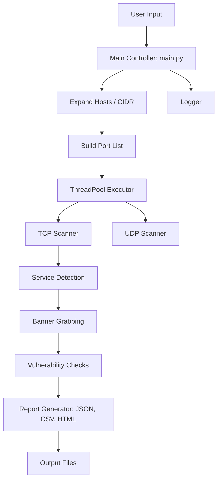
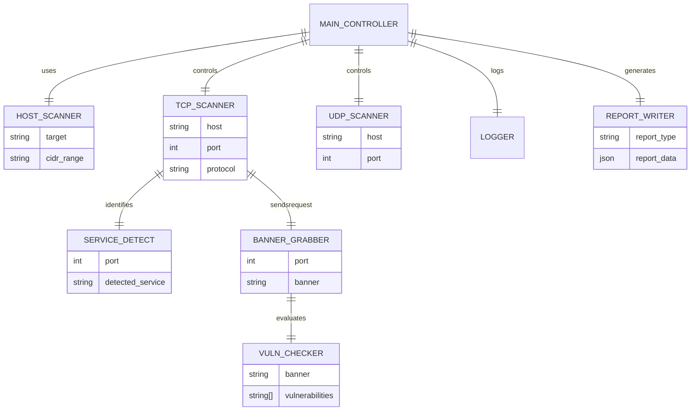

```
 
  ███╗   ██╗███████╗██████╗ ██████╗ ███████╗██████╗ 
  ████╗  ██║██╔════╝██╔══██╗██╔══██╗██╔════╝██╔══██╗
  ██╔██╗ ██║█████╗  ██████╔╝██████╔╝█████╗  ██████╔╝
  ██║╚██╗██║██╔══╝  ██╔══██╗██╔══██╗██╔══╝  ██╔══██╗
  ██║ ╚████║███████╗██║  ██║██║  ██║███████╗██║  ██║
  ╚═╝  ╚═══╝╚══════╝╚═╝  ╚═╝╚═╝  ╚═╝╚══════╝╚═╝  ╚═╝

        ADVANCED NETWORK & PORT SCANNER TOOLKIT
```
---

#         ADVANCED NETWORK & PORT SCANNER TOOLKIT

## **Badges**


---

# 📘 **Introduction**

The **Advanced Network & Port Scanner Toolkit** is a modular, multi-threaded, extensible scanning suite built in Python.  
It is designed for **ethical security assessments**, **network analysis**, **cloud validation**, and **incident response**.

It supports:

- TCP & UDP scanning  
- Multi-threading (ThreadPoolExecutor)  
- Service detection  
- Banner grabbing  
- Multi-host scanning (CIDR support)  
- Vulnerability checks (non-exploitative)  
- JSON, CSV, HTML exporting  
- Tkinter and PyQt GUIs  
- Logging + reporting  
- Nmap-like extended features  

This toolkit focuses on **safe, legal, educational, and defensive use-cases only**.

---

# 📚 **Table of Contents**

1. [Project Architecture](#project-architecture)  
2. [Features](#features)  
3. [Use Cases](#use-cases)  
4. [Pros & Cons](#pros--cons)  
5. [Real-Life Applications](#real-life-applications)  
6. [Installation](#installation)  
7. [Usage](#usage)  
8. [Screenshots](#screenshots)  
9. [Contributing](#contributing)  
10. [License](#license)  

---

# 🏗 **Project Architecture**

```
/scanner
  │── main.py                 → Central controller
  │
  ├── core/
  │   ├── tcp_scanner.py      → Multi-threaded TCP scanning
  │   ├── udp_scanner.py      → UDP scanning support
  │   ├── service_detect.py   → Detect known services
  │   ├── banner_grabber.py   → Grab service banners
  │   ├── host_scanner.py     → CIDR and multiple-host scanning
  │   ├── vulnerability_checks.py → Safe vulnerability checks
  │   └── report_writer.py    → Export JSON/CSV/HTML reports
  │
  ├── gui/
  │   ├── tkinter_gui.py      → Tkinter-based GUI
  │   └── pyqt_gui.py         → PyQt-based modern GUI
  │
  └── utils/
  ├── logger.py           → Logging setup
  └── helpers.py          → Helper tools (OS guess, utilities)
  
````
---

# ⭐ **FLOW DIAGRAMS + ER DIAGRAM + COMPLETE WIKI**

---

# 🎯 **1. SYSTEM FLOW DIAGRAM (ASCII)**

```
                    +------------------+
                    |     User Input   |
                    +---------+--------+
                              |
                              v
                    +------------------+
                    |   Main Controller|
                    |    (main.py)     |
                    +---------+--------+
                              |
               +--------------+--------------+
               |                             |
               v                             v
     +-------------------+        +--------------------+
     | Host Expansion    |        |  Logging System    |
     | (host_scanner.py) |        |   (logger.py)      |
     +---------+---------+        +--------------------+
               |
               v
     +---------------------+
     |  Port Range Builder |
     +---------+-----------+
               |
               v
     +---------------------+
     | Parallel Executor   |
     |  (ThreadPool)       |
     +---------+-----------+
               |
       +-------+--------+
       |                |
       v                v
+--------------+   +--------------+
| TCP Scanner  |   | UDP Scanner  |
| tcp_scanner  |   | udp_scanner  |
+------+-------+   +------+-------+
       |                  |
       v                  v
+--------------+   +--------------+
| Service Detect|  | No Service   |
| getservbyport |  |  Detection   |
+------+--------+   +-------------+
       |
       v
 +---------------+
 | Banner Grabber|
 | banner_grabber|
 +-------+-------+
         |
         v
 +--------------------------+
 |  Vulnerability Checker   |
 | vulnerability_checks.py  |
 +-----------+--------------+
             |
             v
     +---------------------+
     | Report Generator    |
     | JSON / CSV / HTML   |
     +-----------+---------+
                 |
                 v
           +-----------+
           |  OUTPUT   |
           +-----------+
```

---

# 🎯 **2. SYSTEM FLOW DIAGRAM (MERMAID)**



---

# 🎯 **3. ER DIAGRAM (MERMAID)**

*(Shows how modules relate as entities)*



---


# 🚀 **Features**

### 🔥 High-Performance Scanning  
- Multi-threaded TCP scanning  
- UDP scanning support  
- Scans **1–65535 ports**

### 🔍 Service & Banner Detection  
- Auto-detects common services (SSH, FTP, HTTP…)  
- Banner grabbing for fingerprinting  

### 🌐 Multi-Host Scanning  
- CIDR support (`192.168.1.0/24`)  
- Host lists

### 🧪 Safe Vulnerability Checks  
- Outdated SSH  
- Telnet exposure  
- FTP plaintext warnings  
*(No exploits or unsafe behavior)*

### 📊 Reporting & Exporting  
- JSON  
- CSV  
- HTML report generator  

### 🖥 GUI Interfaces  
- Tkinter GUI  
- PyQt GUI  

### 📝 Logging  
- Auto-logging to scan.log  

---

# 🧭 **Use Cases**

### ✔ Cybersecurity / Ethical Hacking (Authorized Only)
- Surface-level recon  
- Detect open services  
- Identify weak configurations  

### ✔ Network Engineers / System Admins
- Validate firewall rules  
- Check server uptime  
- Map enterprise ports  

### ✔ Cloud Security
- Validate cloud VM exposure  
- Audit security group rules  

### ✔ DevOps / SRE
- Pre-deployment port validation  
- Health checks  

### ✔ Digital Forensics / Incident Response
- Discover rogue services  
- Identify malware-opened ports  

---

# ⚖️ **Pros & Cons**

### ✅ **Pros**
- Fast, multi-threaded performance  
- Modular & fully extendable  
- Includes GUI and reports  
- Educational and safe  
- Works across all OS  
- Nmap-like features (basic)  

### ❌ **Cons**
- Not a replacement for Nmap  
- Cannot perform stealth scans (for safety)  
- No exploit modules (intentionally restricted)  
- UDP accuracy varies (normal limitation)  

---

# 🌍 **Real-Life Applications**

- Corporate vulnerability assessments  
- Cloud exposure audits during deployments  
- Academic cybersecurity labs  
- SOC teams verifying suspicious open ports  
- Developers verifying backend services  
- Home users checking router exposures  

---

# 📥 **Installation**

```bash
git clone https://github.com/alok-kumar8765/port_scanner.git
cd port_scanner
pip install -r requirements.txt
````

---

# 🧑‍💻 **Usage**

### Basic Scan

```bash
python main.py
```

### Run Tkinter GUI

```bash
python gui/tkinter_gui.py
```

### Run PyQt Interface

```bash
python gui/pyqt_gui.py
```

### Export JSON / CSV / HTML

```bash
python main.py --json report.json
python main.py --csv report.csv
python main.py --html report.html
```

---

# 🖼 **Screenshots**

```
[Screenshot placeholders]
(Tkinter GUI)
(PyQt GUI)
(HTML Report Output)
```

---

# 🤝 **Contributing**

Pull requests are welcome!
Please follow clean code practices and avoid adding unsafe or exploit-based features.

---

# 📄 **License**

MIT License – free for personal & commercial use.

---

# 🛡 Security Notice

This tool is intended **only for authorized, ethical, and defensive use**.
Do not scan systems you do not own or have permission to test.

```

```
